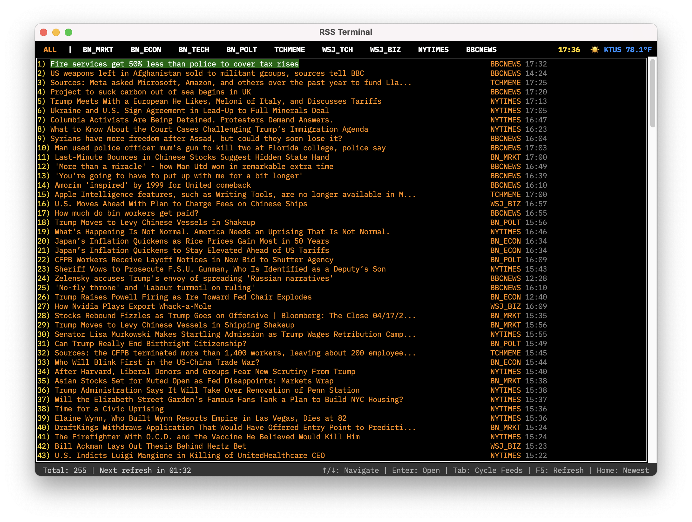

# Terminal-Style Financial News Terminal

A Python application that displays RSS feeds in a terminal-inspired interface. This app provides a nostalgic and professional financial news experience with real-time updates from various sources.



## Features

- Authentic retro terminal UI aesthetic
- Sections for "Top Ranked News" and "Time Ordered News"
- Clickable headlines that open articles in your web browser
- Automatic feed refreshing with countdown timer
- Configurable news sources with standardized source codes (like BFW, RNS, BN)
- Timeline sorted by publication time
- Color-coded interface with amber text on black background

## Installation

### Prerequisites

- Python 3.6+
- tkinter (usually comes with Python)

While not required, install the [IBM Plex Mono](https://fonts.google.com/specimen/IBM+Plex+Mono) font for the best experience.

### Install Dependencies

```bash
pip install -r requirements.txt
```

## Usage

1. Edit the `rss_config.ini` file to add your preferred RSS feeds and set the refresh interval
2. Run the application:

```bash
python main.py
```

3. Click on any headline to view article details or open in your default web browser

## Configuration

The application uses a configuration file named `rss_config.ini` to store settings:

```ini
[Settings]
refresh_interval = 300  # Refresh interval in seconds
timezone = America/Phoenix  # Standard timezone name
airport_code = KTUS  # ICAO airport identifier for weather information
weather_update_interval = 900  # Weather refresh interval in seconds

[Feeds]
# Format: SOURCECODE = feed_url
BN_POLT = https://feeds.bloomberg.com/politics/news.rss
TCHMEME = https://www.techmeme.com/feed.xml
WSJ_TCH = https://feeds.content.dowjones.io/public/rss/RSSWSJD
```

Source codes are displayed next to headlines in the terminal interface. For an authentic terminal look, use 3-6 character source codes.

## Keyboard Shortcuts

- ↑/↓ : Navigate between headlines
- Enter/Space : Open selected article in browser
- ESC : Unselect current article
- Tab/Shift+Tab : Cycle between feeds
- F5 : Refresh all feeds
- g : Go to article by number
- d : Show description of selected article
- ⌘+↑/↓ : Page up/down in article list
- ⌘+Shift+↑/↓ : Jump to first/last article

## Warnings
This project was an experiment in [vibecoding](https://www.robotonwheels.com/projects/rss-terminal), it may not be supported or further developed. 

Overindulging in the news is probably not good for you.

## About

This application was inspired by the Bloomberg Terminal, 1990s bulletin board systems, and the Associated Press teletype my college radio station retired shortly after I arrived.
